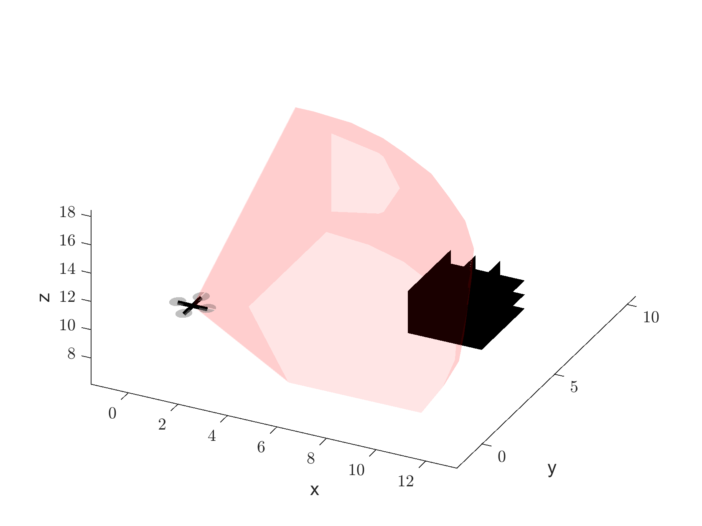

# LiDAR simulation in 2D and 3D in Matlab

This is a repository for simulating depth sensor measurements without the use of Matlab toolboxes

Examples for use include occupancy map updating or obstacle avoidance in a partially known map

## Installation

Clone repository using git clone https://github.com/UVA-BezzoRobotics-AMRLab/MatlabLidarSim.git

## Usage

* Running "2DUGVExample.m" will show a simulation of a 2D vehicle updating a partially known map as it moves through the environment using user-defined sensor parameters

* Running "constantYaw3DExample.m" will show a simulation of a 3D vehicle constantly yawing and moving through the environment. A partially known map is also updated but not pictorially displayed

Below is a picture of the 3D simulation in action:

